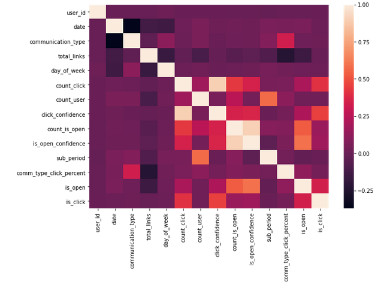
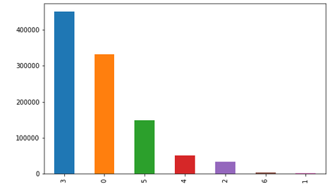
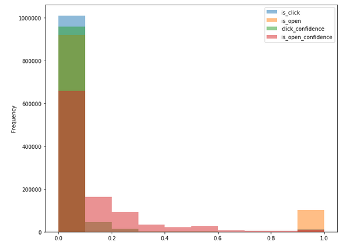
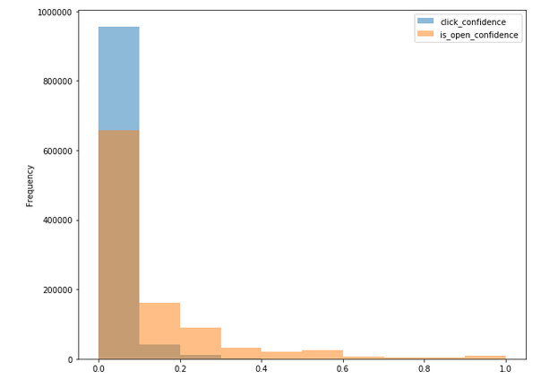
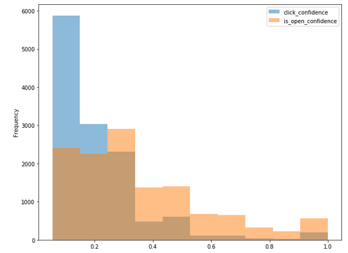
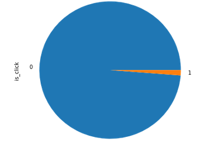

# Lord of the Machine : Data Science Hackathon on Analytics Vidhya

https://datahack.analyticsvidhya.com/contest/lord-of-the-machines/

### 8th place solution

---

#### Precicting user click probability of links inside a mailer for AV email campaigns

Email Marketing is still the most successful marketing channel and the essential element of any digital marketing strategy. Marketers spend a lot of time in writing that perfect email, labouring over each word, catchy layouts on multiple devices to get them best in-industry open rates & click rates. How can I build my campaign to increase the click-through rates of email? - a question that is often heard when marketers are creating their email marketing plans. It's time to unlock marketing potential and build some exceptional data-science products for email marketing.

So, in this hackathon, the challenge was to predict the click probability of links inside a mailer for email campaigns from January 2018 to March 2018.

--- 

## Data Overview

The train dataset used comprised of user-email interaction data of AV email campaigns from July 2017 to December 2017. The task was to predict the click probability of links inside a mailer for email campaigns from January 2018 to March 2018, which formed the test dataset.

### Dataset Description

#### campaign_data.csv

Contains the features related to 52 email Campaigns

| Variable | Definition |
|:--:|:-------:|
| campaign_id | Email campaign ID |
| communication_type | Email agenda |
| total_links | Total links inside the email |
| no_of_internal_links | Total internal links inside the email (redirecting to analyticsvidhya.com) |
| no_of_images | Number of images inside the email |
| no_of_sections | Number of sections inside the email |
| email_body | Email Text |
| subject | Email Subject |
| email_url | Email URL |

#### train.csv

Contains the click and open information for each user corresponding to given campaign id (Jul 17 - Dec 17)

| Variable | Definition |
|:--:|:-------:|
| id | Unique ID for email session |
| user_id | User ID |
| campaign_id | Email Campaign ID |
| send_date | Time stamp for email sent |
| is_open | Did not open - 0, Opened -1 |
| is_click | Did not click - 0, clicked - 1 |

#### test.csv

Contains the user and campaigns for which is_click needs to be predicted (Jan 18 - Mar 18)

| Variable | Definition |
|:--:|:-------:|
| id | Unique ID for email session |
| campaign_id | Email Campaign ID |
| user_id | User ID
| send_date | Time stamp for email sent |

---

## Feature Extraction

### Prominent Features Extracted
- Date 
- Time (in minutes)
- Day of Week
- Communication Type
- Total Links
- No of Internal Links, No of Images
- Subject - Count of Sentences, Letters, Punctuations and Stopwords
- Subject - Unique Word Percentage
- Subject - Punctuation Percentage
- Email - Count of Word, Punctuation and Capital Letters
- Count Click
- Count User
- Click Confidence
- Count of People Opening the Mail
- Open Confidence
- Email Similarity, Subject Similarity
- Subscription Period
- Communication Type Click Percentage
- Count User Frequency
- Sentiment of Mail

#### Correlation between Extracted Features and Output

---

## Data Analysis

#### No of Emails per Communication Type 

#### Distribution of Click Confidence, Open Confidence, Is Open and Is Click

#### Distribution of Click Confidence and Open Confidence for Is Click=0

#### Distribution of Click Confidence and Open Confidence and Is Click=1

Further data analysis - <a href="https://github.com/imrahulr/Lord-of-the-Machines/blob/master/eda.ipynb">Link</a> 

---

## Under-sampling using Repeated Edited Nearest Neighbour Algorithm

The train dataset was highly imbalanced and contained 1010409 samples with is_click=0 while only 12782 samples with is_click=1.

After undersampling the data using RENN, the number of samples with is_click=0 was reduced to 958301. Other algorithms such as ENN, AllKNN and SMOTE were also explored. But I found RENN to the best of all though it required significant amount of time to undersample the dataset.

---

## Our Solution

The overall solution consists of a weighted average ensemble of two boosting algorithms -
- XGBoost
- LightGBM

---

## Results

| Sr No. | Public LB AUC | Private LB AUC |
|:----:|:----:|:------:|
| LightGBM | 0.68173 | - |
| XGBoost | 0.66823 | - |
| Ensemble | 0.68799 | 0.68630 |

- LightGBM outperformed XGBoost by a significant margin. Moreover, it required much less time to train than XGBoost. 
- Extracting prominent features provided a major boost to the score. Most of these features were based on modelling user characteristics and extracting time series properties.
- Undersampling the data also provided a significant increase in the score.
- Boosting algorithms mostly ruled the competition.

### Thank You!

---
